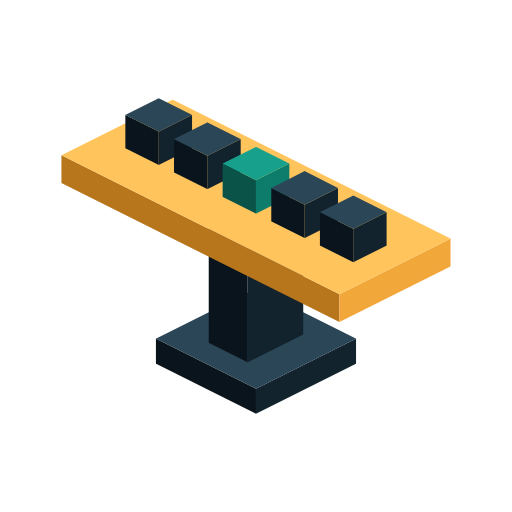

<p align="center">
  <a href="README.md">English</a> |
  <a href="README.de.md">Deutsch</a> |
  <a href="README.es.md">Español</a> |
  <a href="README.fr.md">Français</a> |
  <a href="README.tr.md">Türkçe</a>
</p>

# Tezgah

<p align="center">
  
</p>

<h3 align="center">Un contrato de trabajo para cada asistente de programación de IA que ejecutes.</h3>

<p align="center">
  <a href="LICENSE"></a>
  <a href="https://github.com/r1z4x/tezgah/actions/workflows/ci.yml"></a>
  <a href="https://github.com/r1z4x/tezgah/releases/latest"></a>
</p>

<p align="center"><sub>El inglés es la fuente de la verdad; las traducciones pueden estar desactualizadas.</sub></p>

---

Tezgah arma a cada asistente de programación de IA que ejecutes — **omp, el
host principal**, más Claude Code, Codex, Cursor, opencode y el dsh de
DeepSeek — con un solo contrato de trabajo, dentro de las raíces de
repositorios que configures. Por sí solos, los asistentes divergen: uno
responde en turco mientras otro responde en inglés; uno usa grep donde otro
consulta un grafo de código; uno informa "hecho" sin ejecutar una prueba. Las
reglas residen una sola vez en un núcleo compartido; cada host recibe un
adaptador ligero que las traduce a la forma que entiende — una regla cambiada
en un lugar llega a todos los hosts de la misma manera.

## Por qué tezgah

- **Un contrato, seis hosts.** omp, Claude Code, Codex, Cursor, opencode y dsh
  ven las mismas reglas, porque cada host es un adaptador ligero sobre un
  único núcleo compartido — cambia una regla una vez y todos la adoptan.
- **"Hecho" significa que la comprobación se ejecutó.** Una compuerta de 15
  rechazos detiene la comprobación neutralizada — `--no-verify`, `|| true`,
  una prueba canalizada a `tail`, un skip añadido a mitad de vuelo — y
  bloquea la afirmación de finalización que la ejecución no puede sustentar.
- **La investigación trae su biblioteca.** Las tareas de investigación se
  dirigen a través de OpenResearch con una biblioteca incorporada de 98
  habilidades upstream, cargada de una en una para que el contexto siga
  siendo pequeño.
- **Cada regla tiene un interruptor de apagado.** Dieciséis interruptores — más
  las marcas por repositorio — eliminan el texto de la regla de la sesión, de
  modo que la regla realmente se detiene en lugar de limitarse a figurar como
  desactivada.
- **Respuestas sobre las que puedes actuar.** Las respuestas son en turco salvo que elijas otro idioma, y
  empiezan por el resultado; una lista muestra como máximo cinco elementos
  ordenados; una estimación se nombra como estimación; un error se lee como
  ubicación, causa, solución.

<a id="install"></a>

## Instalación

Una línea, en macOS, Linux o WSL (Python 3.10+, `curl`, `tar`). Descarga la
última versión, comprueba su sha256 y arma cada host que encuentra (Claude
Code a través de su propia CLI `claude plugin`):

```bash
curl -fsSL https://raw.githubusercontent.com/r1z4x/tezgah/main/packaging/install.sh | sh
```

O a través de npm: `npm i -g @r1z4x/tezgah && tezgah --install`.

Una configuración de host que no puede leer queda intacta, cada configuración
que cambia conserva una copia `.tezgah-bak` fechada, y la instalación termina
con un código distinto de cero cuando un host previsto no queda armado.

### Qué cambia tezgah en tu máquina

- **Configuración de los hosts.** Cada host armado recibe los hooks de tezgah,
  sus entradas MCP y un bloque de contrato gestionado en su archivo de reglas
  global (`~/.claude/CLAUDE.md`, `~/.codex/AGENTS.md`,
  `~/.omp/agent/RULES.md`). Los hooks de Claude Code van en un plugin
  registrado con `claude plugin`; sin la CLI `claude`, Claude queda sin armar y
  el informe lo dice.
- **Archivos de agentes en tus repositorios.** Dentro de las raíces
  configuradas, una sesión escribe archivos de subagentes en `.claude/agents/`,
  `.codex/agents/` y `.opencode/agents/`, y añade esos directorios al
  `.git/info/exclude` propio del clon (`TEZGAH_NO_EXCLUDE=1` lo impide).
- **Una comprobación diaria de actualizaciones.** La línea de estado pregunta
  por una versión nueva como mucho una vez al día;
  `~/.config/tezgah/update-check-off` o `TEZGAH_UPDATE_CHECK=0` la desactiva.
- **orx.** La instalación descarga la CLI de OpenResearch por la que pasan las
  tareas de investigación; `TEZGAH_NO_DEPS=1` la omite.
- **Idioma de las respuestas.** Por defecto las respuestas son en turco y la
  regla Stop las sostiene en él. `--reply-lang en` pide inglés, y `any` tu
  propio idioma; ninguno se comprueba: `curl -fsSL … | sh -s -- --reply-lang en`.

¿Prefieres que lo haga tu asistente de programación? Pega esto en omp,
Claude Code, Codex, Cursor u opencode (el prompt queda en inglés; el
asistente lo entiende en cualquier idioma):

```text
Install tezgah (https://github.com/r1z4x/tezgah) on this machine and verify it.

1. Check the prerequisites: python3 --version must be 3.10 or newer, and curl
   and tar must exist. If one is missing, stop and tell me which.
2. Run the installer exactly as published - do not edit it or pipe it anywhere else:
   curl -fsSL https://raw.githubusercontent.com/r1z4x/tezgah/main/packaging/install.sh | sh
   Its output must contain "verified tezgah-<version>.tar.gz" (the sha256
   check). If it does not, stop and show me the output.
3. Verify: run ~/.local/share/tezgah/current/bin/tezgah-setup --version and
   ~/.local/share/tezgah/current/bin/tezgah-setup --report, and show me every
   line that says MISS.
4. Tell me which hosts were armed, which repository root was configured
   (default ~/Projects - if my code lives elsewhere, ask me for the directory and
   run ~/.local/share/tezgah/current/bin/tezgah-setup --roots <dir> --install),
   and that I must restart each assistant for the hooks to load.
Do not change any other file and do not uninstall anything.
```

Versiones fijadas, Windows (`packaging/install.ps1`), tarballs sin conexión,
actualizaciones y las integraciones opcionales están en la [documentación](docs/README.md).

## Hosts compatibles

**omp** (el host principal, contra el que se desarrolla y verifica), **Claude Code**, **Codex**, **Cursor**, **opencode**, **dsh** — adaptadores ligeros sobre un único núcleo compartido.

## Dónde está la profundidad

La compuerta, el registro de evidencia, los adaptadores de host, la configuración y el desarrollo están en [docs/README.md](docs/README.md), una página por pregunta.

## Licencia

MIT — ver [LICENSE](LICENSE).
Las habilidades incorporadas (`ponytail`, `no-ai-slop`, `i-have-adhd`) llevan sus propios términos MIT, registrados en [NOTICE](NOTICE).
