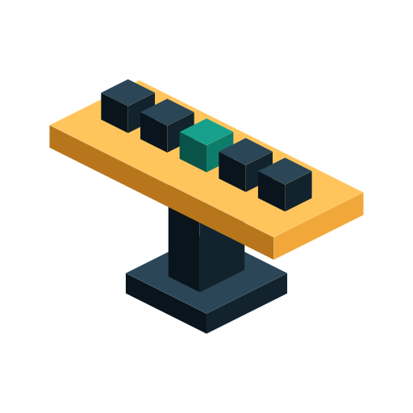

<p align="center">
  <a href="README.md">English</a> |
  <a href="README.zh.md">简体中文</a> |
  <a href="README.zht.md">繁體中文</a> |
  <a href="README.ko.md">한국어</a> |
  <a href="README.de.md">Deutsch</a> |
  <a href="README.es.md">Español</a> |
  <a href="README.fr.md">Français</a> |
  <a href="README.it.md">Italiano</a> |
  <a href="README.da.md">Dansk</a> |
  <a href="README.ja.md">日本語</a> |
  <a href="README.pl.md">Polski</a> |
  <a href="README.ru.md">Русский</a> |
  <a href="README.bs.md">Bosanski</a> |
  <a href="README.no.md">Norsk</a> |
  <a href="README.br.md">Português (Brasil)</a> |
  <a href="README.th.md">ไทย</a> |
  <a href="README.tr.md">Türkçe</a> |
  <a href="README.uk.md">Українська</a> |
  <a href="README.bn.md">বাংলা</a>
</p>

# Tezgah

<p align="center">
  
</p>

<h3 align="center">Один робочий контракт для кожного ШІ-асистента з програмування, який ви запускаєте.</h3>

<p align="center">
  <a href="LICENSE"></a>
  <a href="https://github.com/r1z4x/tezgah/actions/workflows/ci.yml"></a>
</p>

<p align="center">
  <a href="#what-it-enforces">Що він забезпечує</a> &bull;
  <a href="#supported-hosts">Підтримувані хости</a> &bull;
  <a href="#install">Встановлення</a> &bull;
  <a href="#day-to-day">Щоденне використання</a> &bull;
  <a href="#configuration">Конфігурація</a> &bull;
  <a href="#cost">Вартість</a> &bull;
  <a href="#development">Розробка</a> &bull;
  <a href="#contributing">Участь у розробці</a> &bull;
  <a href="#security">Безпека</a> &bull;
  <a href="#license">Ліцензія</a>
</p>

<p align="center"><sub>Англійська версія є першоджерелом; переклади можуть відставати від неї.</sub></p>

---

Один робочий контракт для кожного ШІ-асистента з програмування, який ви запускаєте — Claude Code,
opencode, Codex, Cursor та dsh від DeepSeek — у межах налаштованих кореневих каталогів репозиторіїв.

Якщо залишити їх як є, кожен асистент має власні звички: один відповідає турецькою, інший
англійською; один використовує grep для всього, інший робить запити до графа коду; один каже
«готово» без запуску тесту. tezgah усуває ці розбіжності. Відкрийте будь-який хост, і ви
отримаєте ту саму мову, ту саму дисципліну та той самий стандарт доказів.

Дизайн складається з двох рівнів. Правила існують в одному екземплярі у спільному ядрі; кожен хост отримує
тонкий адаптер, який перетворює це ядро у формат, зрозумілий хосту. Змініть правило в одному місці, і всі п'ять хостів побачать це — жодного п'ятикратного копіювання
одного й того ж тексту.

<a id="what-it-enforces"></a>

## Що він забезпечує

- **Звітування турецькою з акцентом на результат.** Кожна відповідь надається турецькою мовою і починається з
  результату або рішення (BLUF), після чого йдуть пункти, впорядковані за впливом. Код, коміти,
  документація та промпти субагентів залишаються англійською; імена, CLI-команди та рядки
  помилок ніколи не перекладаються.
- **Мінімальний код (ponytail).** Найлінивіша зміна, яка дійсно працює: YAGNI,
  потім повторне використання існуючого хелпера, потім stdlib, потім нативна функція платформи,
  потім встановлена залежність, потім один рядок. Жодних незапитуваних абстракцій.
  Валідація, обробка помилок та безпека ніколи не спрощуються.
- **Пошук насамперед через граф коду.** Запитання «де знаходиться X», «хто викликає Y», «що зламається, якщо
  зміниться Z» спрямовуються до графа `codebase-memory-mcp` (`search_graph`,
  `trace_path`, `search_code`), а не до grep. Grep залишається доречним для буквального тексту,
  конфігурацій та файлів, що не містять коду.
- **Аналіз додатків насамперед через доступність.** Запущений веб- або мобільний додаток зчитується
  через його дерево доступності / DOM / нативне дерево представлень, а не через скріншот на кожному кроці.
  `analyze-app` охоплює браузер (Playwright MCP), iOS Simulator або емулятор Android (Mobile MCP), та додаткову веб-діагностику (Chrome DevTools MCP);
  скріншот — це явна дія за запитом для того, на що дерево не може дати відповідь.
- **Зовнішня альтернативна думка.** Перед нетривіальним або важкозворотним викликом,
  `~/.config/tezgah/bin/consult` паралельно запитує незалежні моделі через OpenRouter (або DeepSeek API
  з `--provider deepseek`), і агент звітує, у чому вони
  погодилися або розійшлися.
- **Дослідження через OpenResearch.** Коли роутер визначає, що завдання є дослідженням —
  огляд літератури, формування та перевірка гіпотез, проведення експериментів,
  дослідницький артефакт — він спрямовує роботу через OpenResearch від alphaXiv (`orx`)
  і спочатку завантажує посібник `orx`, замість того, щоб імпровізувати з протоколом. Звичайний
  пошук у коді залишається на графі коду. Якщо `orx` відсутній, роутер повідомляє про це
  і перемикається на субагента хоста.
- **Чесність під час перевірки.** Ніщо не звітується як виконане, протестоване або виправлене,
  доки не буде побачено результат. Про тест, що не пройшов, повідомляється як про невдалий з його
  точною помилкою, а про пропущену перевірку заявляється прямо.
- **Жодної згадки про ШІ, ніде.** Ніщо збережене або опубліковане — повідомлення комітів,
  злиттів та тегів, тексти PR та issue, коментарі в коді, заголовки файлів, документація
  — не може містити згадок про асистента, модель, постачальника або «ШІ». Використовувати інструмент — це нормально;
  підписувати його ім'ям свою роботу — ні.
- **Дворівнева оркестрація.** Головний потік приймає рішення та перевіряє; дешева
  модель (`~/.config/tezgah/bin/codegen`, OpenRouter за замовчуванням або `--provider deepseek`) створює чернетки
  обмежених, чітко специфікованих редагувань у тимчасовому каталозі. Нічого не потрапляє до репозиторію
  інакше, ніж через роутер, а невдала чернетка автоматично перемикається на головну модель.
- **Субагенти для кожного репозиторію.** На початку сесії поточний репозиторій отримує невеликий набір
  агентів з обмеженими можливостями (`tezgah-explorer`, `tezgah-reviewer`,
  `tezgah-researcher`, `tezgah-verifier`) плюс `tezgah-orchestrator`, які рендеряться
  у нативне середовище кожного встановленого хоста (Claude/Cursor `.claude/agents/`,
  opencode `.opencode/agents/` плюс ін'єкція конфігурації на льоту, Codex
  `.codex/agents/`) та ігноруються одним керованим блоком у `.gitignore`. У Claude список дозволених
  `Agent(tezgah-*)` оркестратора діє лише тоді, коли він працює як
  головний потік (`claude --agent tezgah-orchestrator`); як субагент цей список
  ігнорується. dsh не має середовища для окремих ролей, тому його покриває правило роутера контракту.

<a id="supported-hosts"></a>

## Підтримувані хости

| Хост | Підключення через | Рядок стану |
|---|---|---|
| **Claude Code** | локальний маркетплейс плагінів: хуки, команди, два агенти лише для читання, стиль виводу | нативний `statusLine` |
| **opencode** | плагін + інструкції + MCP + згенерований роутер навичок (нативний список навичок заборонено), автоіндексація репозиторію при першому повідомленні | TUI плагін (без командного statusLine) |
| **Codex** | `hooks.json` + навички + MCP, включаючи шлюз `PreToolUse` | хук `systemMessage` (список елементів футера закритий) |
| **Cursor** | `hooks.json` + навички + MCP | `statusLine` у `cli-config.json` |
| **dsh** | міст хуків Claude Code + керований блок патчів (хуки, MCP, маршрути LLM, позадеревний веб-рядок стану) | Web UI плагін: `tezgah-dsh-statusline` у заголовку сесії |

Шлюз Codex пропускає Bash, `exec_command`, `apply_patch`, Edit/Write, інструменти MCP,
та виклики субагентів через ту саму перевірку, що й інші хости. У Claude заборона на
атрибуцію також забезпечується механічно: налаштування `attribution`
очищується (`commit`, `pr`, `sessionUrl`), тому згадки в комітах та PR вимикаються на рівні джерела.

### Рядок стану

Кожен хост рендерить однаковий однорядковий чеклист з `tezgah-status`, тому вони
не можуть розходитися. Суть полягає у стані: позначка є **зеленою**, коли правило активоване
і діє в цій сесії, **жовтою**, коли воно активоване, але за запитом (ще не використовувалося),
і **червоною**, коли аварійний вимикач (kill switch) вимкнув його. `idx` окремо звітує про готовність графа
(`✓` проіндексовано, `↻` застаріло, `✗` не проіндексовано, `–` не застосовується), а
`plans N (M blk)` — про відкриті плани. `tezgah-status --legend` виводить легенду,
`--json` надає ті самі сегменти для UI, а `--no-color` (або `NO_COLOR`)
примусово використовує звичайний текст. Claude Code та Cursor розфарбовують нативний рядок стану;
TUI opencode розфарбовує власний компонент і оновлюється через шину подій хоста;
Web UI dsh розфарбовує свій компонент заголовка і оновлюється лише тоді, коли його вкладка
видима; Codex показує звичайний рядок у `systemMessage`.

dsh запускає ті самі файли хуків Claude через свій міст `dsh-hooks-claude-code`,
тому контракт початку сесії, шлюз атрибуції та підказка про першочергове використання grep
застосовуються і там. dsh надає єдиний інструмент `subagent`, тому заборона на використання grep лише для explorer
є інертною — немає субагента explorer, якому можна було б відмовити. Пісочниця `workspace-write` за замовчуванням у dsh
обмежує підпроцеси хуків робочою областю та тимчасовим каталогом платформи, тому tezgah записує свій стан хуків (позначки підказок, штамп індексу) у
доступний для запису резервний каталог там, замість того, щоб завершуватися помилкою через відмову в записі. Воркер індексу графа
не може записати кеш `codebase-memory-mcp` зсередини цієї пісочниці, тому
лаунчер `dsh` прогріває індекс у необмеженій оболонці користувача перед завантаженням
dsh — новий репозиторій індексується точно так само, як і на інших хостах, зі штампом HEAD.
Сесія, завантажена без лаунчера, все одно отримує чіткий звіт про те, що
MCP-сервер поза пісочницею обслуговує граф і потребує `index_repository` для репозиторію,
який він не проіндексував, замість сирої помилки `EPERM`. Керований
блок патчів також оголошує два сумісні з OpenAI маршрути LLM на адаптері pi-ai,
який монтує базова композиція: `openrouter` (`OPENROUTER_API_KEY`) та `deepseek`
(`DEEPSEEK_API_KEY`), які можна вибрати поряд із нативним `deepseek-official`
за замовчуванням. Ключі отримуються з середовища запуску або сховища облікових даних платформи;
жоден ключ не потрапляє до конфігураційного файлу. tezgah-setup також розміщує лаунчер `dsh`
у PATH (`~/.local/bin/dsh`), який знаходить встановлений CLI у
`$DSH_HOME`, тому `dsh --profile web` працює з будь-якого каталогу.

dsh не має командного рядка стану, тому tezgah постачає його як Web UI плагін:
`tezgah-dsh-statusline`. Його хостова частина обслуговує рядок `tezgah-status` для
робочої області сесії через автентифікований маршрут `/api/tezgah.status` (з
`?format=json` для кольорового вигляду); його браузерна частина рендерить його у заголовку сесії,
розфарбованим відповідно до стану з легендою при наведенні/кліку, і оновлюється лише тоді, коли
вкладка видима. `tezgah-setup`
лінкує плагін у веб-профіль і вмикає його за допомогою керованого рядка у
`profiles/web/cordis.patch.yml` (лише для web, оскільки хостова частина ін'єктує сервіс
`connection`, доступний лише для web); профіль, який ніколи не завантажував `web`, пропускається
з підказкою замість того, щоб бути записаним наполовину. У режимі `headless` міст хуків
ін'єктує контракт SessionStart як власний завершальний хід (його `agent/session-start`
викликає `agent.inject()` від'єднано, після того, як одноразове завдання вже є першим
повідомленням), тому `dsh --profile headless "<task>"` витрачає один додатковий хід і, для
промпту з буквальною відповіддю, друкує реакцію моделі на контракт, а не
відповідь на завдання; інтерактивні веб-сесії не зазнають впливу.

`bin/tezgah-setup --install` також запускає `orx install-skills` для Claude,
Codex, opencode та Cursor, коли `orx` знаходиться у PATH, тому правило дослідження має
посібник для завантаження. Файли-прошарки належать orx, тому tezgah лише запускає цей інсталятор
і ніколи не додає їх до списку для видалення. dsh не має оснастки orx; правило дослідження
там перемикається на `orx skill` в оболонці.

Плагін Claude також постачає двох агентів лише для читання. `agents/tezgah-explorer.md`
виконує пошук коду з графа і повертає докази у форматі `file:line`;
`agents/tezgah-reviewer.md` перетворює diff у його набір впливу за допомогою
`detect_changes`, а потім шукає реальні дефекти. В обох вимкнені інструменти запису та команд;
їхній вивід має рекомендаційний характер.

### Аналіз додатків

`analyze-app` керує запущеним додатком з його дерева доступності.
Цикл за замовчуванням: відкрити, прочитати дерево, виконати дію, спостерігати за консоллю/мережею/логами,
та перечитати дерево — скріншот є явною дією для того, на що дерево не може
дати відповідь (canvas, гра, анімація, візуальна регресія на рівні пікселів). Навичка є
єдиним шляхом для всіх хостів; сервери під нею є єдиною спільною специфікацією у
`hooks/tezgah_apps.py`:

| Сервер | Ціль | Підключення через |
|---|---|---|
| `playwright` (`@playwright/mcp`) | веб-сторінки, інструменти `browser_*` | opencode, Codex, Cursor, Claude (плагін `.mcp.json`) |
| `mobile-mcp` (`@mobilenext/mobile-mcp`) | iOS Simulator / емулятор Android, інструменти `mobile_*` | те саме |
| `chrome-devtools` (за бажанням, `--devtools`) | трасування веб-продуктивності, глибока мережа, консоль із source-map | те саме |

Браузер запускає **ізольований** профіль за замовчуванням, тому запуск ніколи не торкається
вашого реального стану Chrome; аналіз потоку з авторизацією — це навмисне підключення
(`--cdp-endpoint` або розширення Playwright), а не дія за замовчуванням. Скріншоти,
трасування та дампи дерева потрапляють у `~/.cache/tezgah/apps` (перевизначається за допомогою
`TEZGAH_ARTIFACTS`), і агент отримує шлях назад, а не байти зображення у тексті.
Сервери запускаються через `npx`, тому їм потрібен node, але не потрібне власне встановлення;
`tezgah-setup --install --devtools` додає додатковий сервер веб-діагностики.
dsh підключає ті самі два сервери через свій міст `dsh-mcp-client`
(`serverName` / `command` / `args` / `env`, підтверджено опублікованою
схемою конфігурації), а Claude отримує їх з `.mcp.json` плагіна
(`claude plugin details tezgah` показує 2 MCP-сервери, і обидва підключаються).
`mobile-mcp` — це частина з вищим рівнем тертя: macOS може запитати дозвіл на Доступність /
Запис екрана, а дерево представлень може впасти під навантаженням, тому навичка
повторює спробу отримати дерево перед тим, як перемкнутися на скріншот.

CI запускає детерміноване рукостискання для обох серверів (без браузера, без пристрою):
`TEZGAH_E2E_STRICT=1 python3 tests/e2e_analyze_wiring.py`. Два локальні
smoke-тести за бажанням йдуть далі: `TEZGAH_E2E_APPS=1 python3 tests/e2e_analyze_web.py` запускає
Playwright MCP, переходить за посиланням і читає знімок без скріншота;
`TEZGAH_E2E_APPS=1 python3 tests/e2e_analyze_mobile.py` запускає Mobile MCP, перевіряє
інструменти дерева представлень і виводить список пристроїв. Вони друкують `SKIP: ...`, коли node,
збірка браузера або пристрій відсутній.

<a id="install"></a>

## Встановлення

Потрібен Python 3.8+. node + npm необхідні для хоста dsh і, разом з `pnpm`,
для його веб-рядка стану. Додаткові інтеграції деградують поступово:
`codebase-memory-mcp` у PATH забезпечує роботу графа; ключ моделі забезпечує роботу `consult`
та `codegen` — OpenRouter за замовчуванням (`OPENROUTER_API_KEY` або
`~/.config/openrouter/key`), або DeepSeek API з `--provider deepseek`
(`DEEPSEEK_API_KEY` або `~/.config/deepseek/key`); а `orx` від OpenResearch
у PATH дає правилу дослідження чим керувати. Коли ключ обраного провайдера
відсутній, tezgah повідомляє про це, замість того, щоб вдавати, що все працює.

Клонуйте, а потім активуйте кожен виявлений хост за один прохід:

```bash
git clone https://github.com/r1z4x/tezgah.git ~/Projects/tezgah
cd ~/Projects/tezgah
bin/tezgah-setup --install
```

`--install` також встановлює відсутні додаткові інструменти, запускаючи власний
інсталятор кожного постачальника **через мережу**: `orx`
(`openresearch.sh/install.sh`), `cursor-agent` (`cursor.com/install`), `dsh`
(його домашній профіль через `npx`) та `pnpm`, коли він потрібен dsh (через `npm`) —
включно з `curl ... | sh`. Жоден з них не потребує sudo; запуск записується у
`~/.config/tezgah/install.log`. Попередній перегляд за допомогою `--dry-run`, пропуск за допомогою
`--no-deps` (корисно в CI), або встановлення лише інструментів за допомогою `--deps`. Інструменти
потрапляють у `~/.local/bin` або `~/.cargo/bin`, тому може знадобитися нова оболонка,
перш ніж вони з'являться у PATH; власні перевірки tezgah шукають у цих каталогах незалежно від цього,
тому неінтерактивна оболонка все одно звітує про їхню наявність.

Якщо попереднє налаштування вже присутнє, спочатку імпортуйте його — воно буде переміщене,
а не видалене:

```bash
bin/tezgah-setup --adopt
```

Claude Code встановлюється через власний канал плагінів:

```bash
claude plugin marketplace add ~/Projects/tezgah
claude plugin install tezgah@rizacan-local
```

За необхідності явно обмежте встановлення:

```bash
bin/tezgah-setup --install --hosts claude,codex,opencode,cursor,dsh
bin/tezgah-setup --roots ~/work:~/oss --install
```

<a id="day-to-day"></a>

## Щоденне використання

Нічого не потрібно запускати: правила завантажуються під час старту хоста. Варто знати кілька команд:

| Команда | Призначення |
|---|---|
| `bin/tezgah-setup` | Звіт про те, що активовано для кожного хоста |
| `bin/tezgah-status [PATH]` | Показати, чи активні правила у цьому репозиторії |
| `bin/tezgah-setup --status [PATH]` | Вивести чеклист активованого/використаного |
| `bin/tezgah-setup --deps [--dry-run]` | Встановити відсутні додаткові інструменти (orx, cursor-agent, dsh) |
| `bin/tezgah-doctor [--clean] [--prune-sessions DAYS]` | Звіт про використання диска оснасткою; `--clean` видаляє старі логи індексу та виконує vacuum для БД opencode; `--prune-sessions` видаляє неактивні сесії (єдина дія, яка дійсно зменшує БД) |
| `/plan-add` | Перетворити частину роботи на відстежуваний план |
| `/plan-status` | Підсумувати відкриті плани та вибрати наступний |
| `/plan-sync` | Закрити завершені плани |
| `bin/tezgah-setup --version` | Вивести версію плагіна |
| `bin/tezgah-setup --uninstall` | Видалити лише символічні посилання tezgah, записи хуків хоста та керований блок dsh |

<a id="configuration"></a>

## Конфігурація

tezgah активується лише у своїх налаштованих кореневих каталогах; будь-де інде він неактивний.

- Кореневий каталог за замовчуванням: `~/Projects`.
- `~/.config/tezgah/config.json`: `{"roots": ["~/Projects", "~/work"]}`.
- `TEZGAH_ROOTS` (список, розділений роздільником шляхів) перевизначає файл для одноразових запусків та CI.

Аварійні вимикачі (kill switches) знаходяться у `~/.config/tezgah/`. Кожен з них видаляє своє правило з
тексту, що ін'єктується в сесію, тому правило дійсно зупиняється:

| Вимикач | Вимикає |
|---|---|
| `exec-mode.off` | звітування турецькою з акцентом на результат |
| `ponytail-auto.off` | правило мінімального коду |
| `spec-off` | правило специфікації перед створенням |
| `consult-off` | правило зовнішньої альтернативної думки |
| `research-off` | маршрутизацію дослідницьких завдань до OpenResearch |
| `orchestrate-off` | делегування субагентам (додає рядок про заборону делегування) |
| `reminder-off` | текст нагадування на кожному ході |
| `pretooluse-off` | сам шлюз PreToolUse (атрибуція, explorer, підказка про grep) |

Для кожного репозиторію `.no-ponytail`, `.no-cbm` та `.no-lessons` вимикають правило мінімального коду,
правило графа коду (та його автоіндексацію) і реєстр уроків відповідно.

Коли користувач позначає помилку, агент додає однорядковий урок до `.tezgah/lessons.md` репозиторію;
найновіші рядки ін'єктуються на початку сесії, щоб та сама помилка не могла непомітно повторитися.

<a id="cost"></a>

## Вартість

Виміряно на цій машині (macOS, Python 3.10), а не оцінено:

- **Контекст.** Початок сесії ін'єктує ~4.8 КБ (~1.2 тис. токенів) тексту контракту.
  У Codex нагадування розміром 480 байт супроводжує кожен хід; Claude та інші хости
  не мають хука на кожному ході, тому їхня вартість за хід дорівнює нулю. Повна навичка `tezgah-contract`
  (~19.9 тис. символів) оплачується лише тоді, коли завдання завантажує її. В opencode
  контракт постачається як файл інструкцій розміром ~5.5 КБ. Інакше opencode
  ін'єктував би ~53 КБ тексту з назвами/описами/розташуванням навичок у системний промпт кожної сесії;
  tezgah забороняє цей список (`permission.skill = deny`) і натомість постачає
  згенерований роутер навичок розміром ~16 КБ, тому навичка знаходиться шляхом зчитування її
  шляху `SKILL.md` з роутера.
- **Затримка.** Хуки є окремими процесами Python, тому домінує запуск інтерпретатора (~19 мс).
  На додаток до цього, початок сесії додає ~25 мс, виклик інструменту через шлюз
  (Bash/Grep/Task) додає ~9 мс, а сегмент Stop у Codex додає ~15 мс на кожному ході.
- **Диск.** Встановлення займає ~58 мс, і кожен файл, який перезаписує tezgah, зберігається
  один раз як `<file>.tezgah-bak`.

Віддача проявляється у запитаннях користувача. В одному реальному репозиторії стандартний `grep`
проігнорував відповідну папку і нічого не знайшов; з вимкненим ігноруванням це зайняло
3.95 с і все одно змішало визначення з місцями викликів. Граф коду відповів на
те саме запитання за 16 мс, перерахувавши лише 8 справжніх місць викликів.

opencode також налаштований на гігієну контексту для довгих сесій: `tezgah-setup --install`
встановлює `compaction.prune`, щоб старі результати інструментів очищалися з промпту
замість того, щоб надсилатися повторно на кожному кроці, а список `watcher.ignore` утримує
спостерігач за файлами подалі від `.git`, `node_modules` та каталогів збірки.
Обидва параметри об'єднуються — явне значення користувача має пріоритет. Це важливо, оскільки opencode
виконує автостиснення лише поблизу ліміту контексту моделі (для моделі на 1 млн токенів — близько 980 тис.),
тому без очищення робочий набір зростає до сотень тисяч токенів. `bin/tezgah-doctor`
звітує про результуючий обсяг на диску; `--prune-sessions DAYS` видаляє неактивні сесії
через CLI opencode, що є єдиною дією, яка дійсно зменшує базу даних —
сам по собі VACUUM не може цього зробити, оскільки всі його сторінки є активними.

<a id="development"></a>

## Розробка

```bash
python3 -m unittest discover -s tests -v   # stdlib test suite
pip install -r requirements-dev.txt        # pinned ruff, the only dev dep
ruff check .                               # lint (config in pyproject.toml)
```

CI запускається як на Python 3.10, так і на 3.12. Щоб оновити встановлену копію Claude з цього чекауту,
використовуйте `bin/tezgah-setup --sync`, і перевірте маніфест за допомогою
`claude plugin validate .claude-plugin/plugin.json`. При підвищенні версії,
оновлюйте `.claude-plugin/plugin.json` та `.claude-plugin/marketplace.json`
разом — вони повинні збігатися.

`codebase-memory-mcp` встановлюється користувачем. Хуки та файли Orca не є
частиною цього проєкту і залишаються недоторканими. Claude отримує завжди увімкнене ядро
з хука SessionStart; `output-styles/tezgah.md` є дублікатом для збірок,
які завантажують стилі виводу плагінів, тому хук є авторитетним шляхом.

<a id="contributing"></a>

## Участь у розробці

Невеликі, вузькоспрямовані зміни найлегше прийняти. Правило належить до
спільного ядра (`hooks/`), якщо воно не є дійсно специфічним для хоста; відмінність хоста
належить до його адаптера у `hosts/<name>/`. Зберігайте diff настільки коротким, наскільки це
можливо, залишаючись при цьому правильним — власне правило мінімального коду проєкту застосовується до
самого проєкту.

Перед відкриттям pull request запустіть ті самі три перевірки, які запускає CI:

```bash
python3 -m compileall -q hooks hosts bin statusline.py   # byte-compile every script
python3 -m unittest discover -s tests                     # stdlib test suite
ruff check .                                              # lint; config in pyproject.toml
```

`ruff` встановлюється з `requirements-dev.txt` (`pip install -r requirements-dev.txt`),
що є єдиною залежністю для розробки.

<a id="security"></a>

## Безпека

Повідомляйте про вразливості приватно через рекомендації з безпеки GitHub
(вкладка **Security** → **Report a vulnerability**), а не через публічне issue.

tezgah запускає хуки оболонки, записує конфігурацію хоста та ін'єктує текст у кожну
сесію, тому все, що змушує хук виконувати контрольований зловмисником код, призводить до витоку
ключа у конфігураційний файл, розширює пісочницю або дозволяє вмісту репозиторію ескалюватися
до тексту інструкцій, підпадає під розгляд. Вкажіть хост, версію tezgah
(`bin/tezgah-setup --version`) та мінімальний приклад для відтворення.

<a id="license"></a>

## Ліцензія

Кореневий файл `LICENSE` (MIT) поширюється на власні файли tezgah. `skills/ponytail` та
`skills/no-ai-slop` постачаються на їхніх власних умовах MIT, записаних у `NOTICE`.
